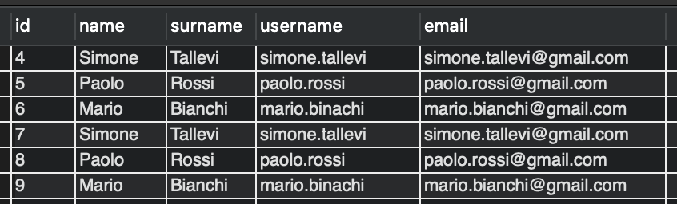

# Track DB Changes With Liquibase

## Setup your DB Schema

If you already have a MySql DB installed in your machine you can skip di steps

1 Start your mysql database instances:

- If is the first time your are running the container
```
docker run -p 3306:3306 --name mysql_80 -e MYSQL_ROOT_PASSWORD=password -d mysql:8
```

If you already have run the previous command and yiu want to re-run the stopped container
```
docker start mysql_80
```

2 Connect to the docker instance
```
docker exec -it mysql_80 /bin/bash
```

3 Connect to the database
```
mysql -h localhost -u root -p
```

4 Create your schema
```
CREATE SCHEMA TRY2CATCHIT DEFAULT CHARACTER SET utf8;
```

4 Exit from the container
```
exit
```

## Start your Docket instance of MySql
If you already have run the command to create the docker instance of MySql, 
you can just run the following command to run the previous created instance.
```
docker start mysql_80
```

## Configure Liquibase 

Install Liquibase by following these instructions [HERE](https://www.liquibase.org/get-started/first-steps).

Test your the Liquibase installation with the following command:

```
liquibase --version
```

expected output:

```
Starting Liquibase at Thu, 25 Jun 2020 00:31:01 CEST (version 3.10.0 #10 built at Thu Jun 11 09:47:49 UTC 2020)
Liquibase Version: 3.10.0
Liquibase Community 3.10.0 by Datical
Running Java under /Library/Java/JavaVirtualMachines/jdk-11.0.4.jdk/Contents/Home (Version 11.0.4)
```

Download your MySql 8 jdbc Driver from [HERE](https://repo1.maven.org/maven2/mysql/mysql-connector-java/8.0.19/mysql-connector-java-8.0.19.jar) 
and place it in the root folder of the project.

Configure Liquibase properties in the ``liquibase.properties`` 
file and place it in the root of the project.

```
driver=<DRIVER>
classpath=<DRIVER-JAR>
url=jdbc:mysql://<HOST>:<PORT>/<SCHEMA>?useSSL=false&nullNamePatternMatchesAll=true&serverTimezone=UTC
username=<USER>
password=<PASSWORD>
changeLogFile=db-changes-master.xml
logLevel=info
```

Below an example

```
driver=com.mysql.cj.jdbc.Driver
classpath=mysql-connector-java-8.0.19.jar
url=jdbc:mysql://localhost:3306/TRY2CATCHIT?useSSL=false&nullNamePatternMatchesAll=true&serverTimezone=UTC
username=root
password=password
changeLogFile=db-changes-master.xml
logLevel=info
```

## Run the migrations

At this point we should have the schema `TRY2CATCHIT` created and Liquibase installed and configured.

Below are some of the most used commands,
however for more information have a look at the full documentation [HERE](https://www.liquibase.org/)

### 1 Start the migrations

To run all the migration listed in the files `db-changes-master.xml` 

```
<include file='db-changes/1-USER-STORY100-users.xml' relativeToChangelogFile='true'/>
<include file='db-changes/2-USER-STORY101-posts.xml' relativeToChangelogFile='true'/>
<include file='db-changes/3-USER-STORY102-adding-users-creation-time.xml' relativeToChangelogFile='true'/>
```

You can run the following command:
```
liquibase update
```

This is what happened in the DB Schema `TRY2CATCHIT`:


The tables `posts` and `users` were created together with the tables 
`DATABASECHANGELOG` and `DATABASECHANGELOGLOCK`.

The tables `DATABASECHANGELOG` and `DATABASECHANGELOGLOCK` are Liquibase table 
responsible for:
 - `DATABASECHANGELOG` is keeping track of all changes applied to the DB.
 - `DATABASECHANGELOGLOCK` is locking the `DATABASECHANGELOG` while a migration is running, 
 to avoid multiple simultaneous migrations.

After the liquibase migration, your `DATABASECHANGELOG` will look like this one below
 

Now let's have a look at the `users` and `posts` tables.
 
The `users` table matches the initial create
 

The `posts` tables instead doesn't match the initial create because of the third migration.  
So the `posts` tables is in the following status:

 

### 2 Rollback a migration

If we need to rollback a migration we can run the command below. 
The rollback will undo the last migration applied on the `DATABASECHANGELOG` table
and it will restore the DB schema at the previous state.

```
liquibase rollbackCount 1
```
After the liquibase rollback, your `DATABASECHANGELOG` will look like this one below
 

The `posts` tables will look like this
 

### 3 Environment dependent migration
If you want to run different migrations for different environment you can use the `context` 
option like in the example below. The `context` provided in the input command need to match the context specified in the liquibase 
migration.

Below an example of migration with the specified context `context="test"`
```
<changeSet author="simone.tallevi" id="4-USER-STORY103-environment-dependent" context="test">
    <sql>
        INSERT INTO `users` (`name`, `surname`, `username`, `email`)
        VALUES ('Simone', 'Tallevi', 'simone.tallevi', 'simone.tallevi@gmail.com');
        INSERT INTO `users` (`name`, `surname`, `username`, `email`)
        VALUES ('Paolo', 'Rossi', 'paolo.rossi', 'paolo.rossi@gmail.com');
        INSERT INTO `users` (`name`, `surname`, `username`, `email`)
        VALUES ('Mario', 'Bianchi', 'mario.binachi', 'mario.bianchi@gmail.com');
    </sql>
    <rollback>
        DELETE FROM `users` WHERE `username` IN ('simone.tallevi', 'paolo.rossi', 'mario.binachi')
    </rollback>
</changeSet>
```

By running this command 

```
liquibase update -Dcontext=test
```

The `users` table will be loaded with test data

 
